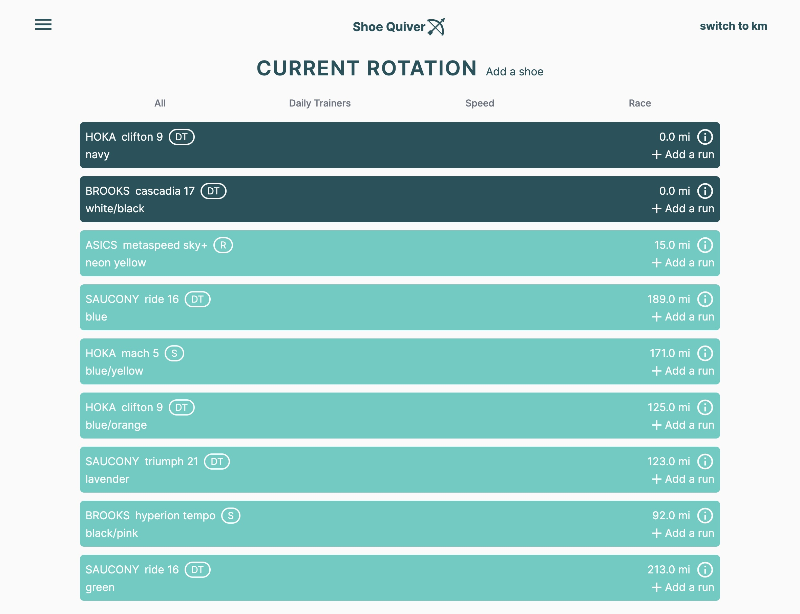
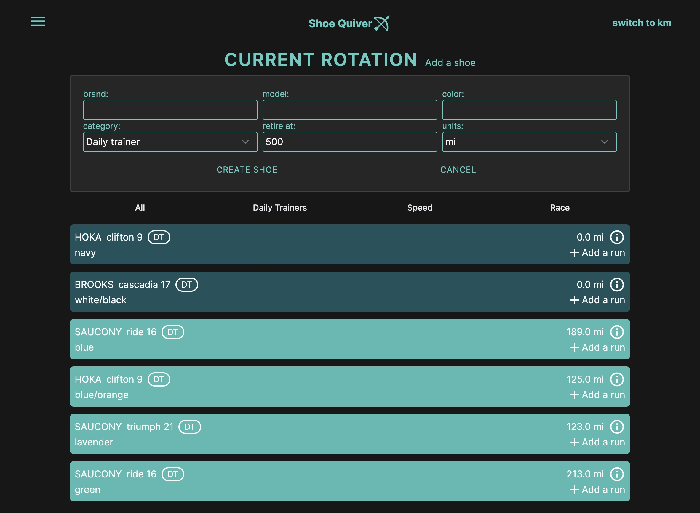
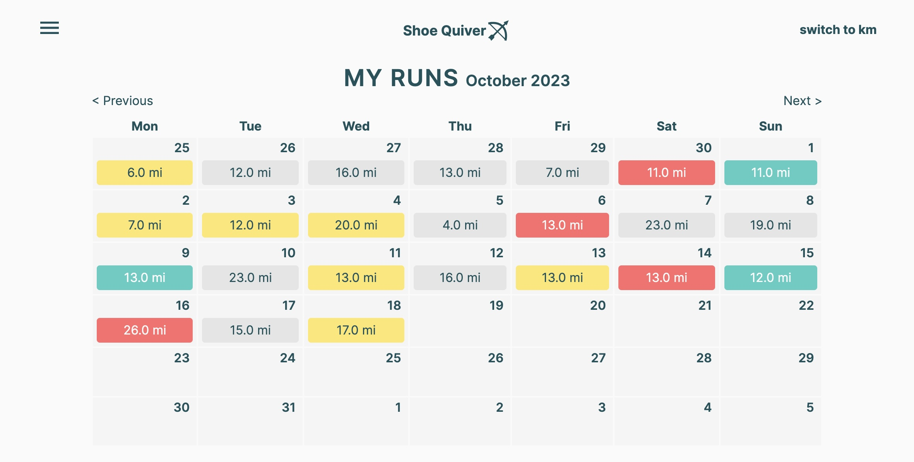
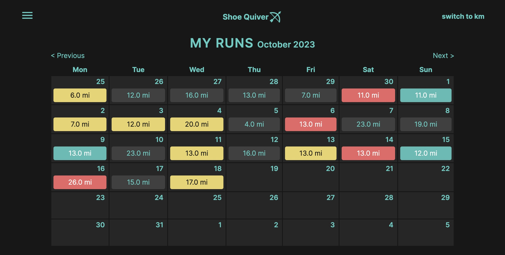
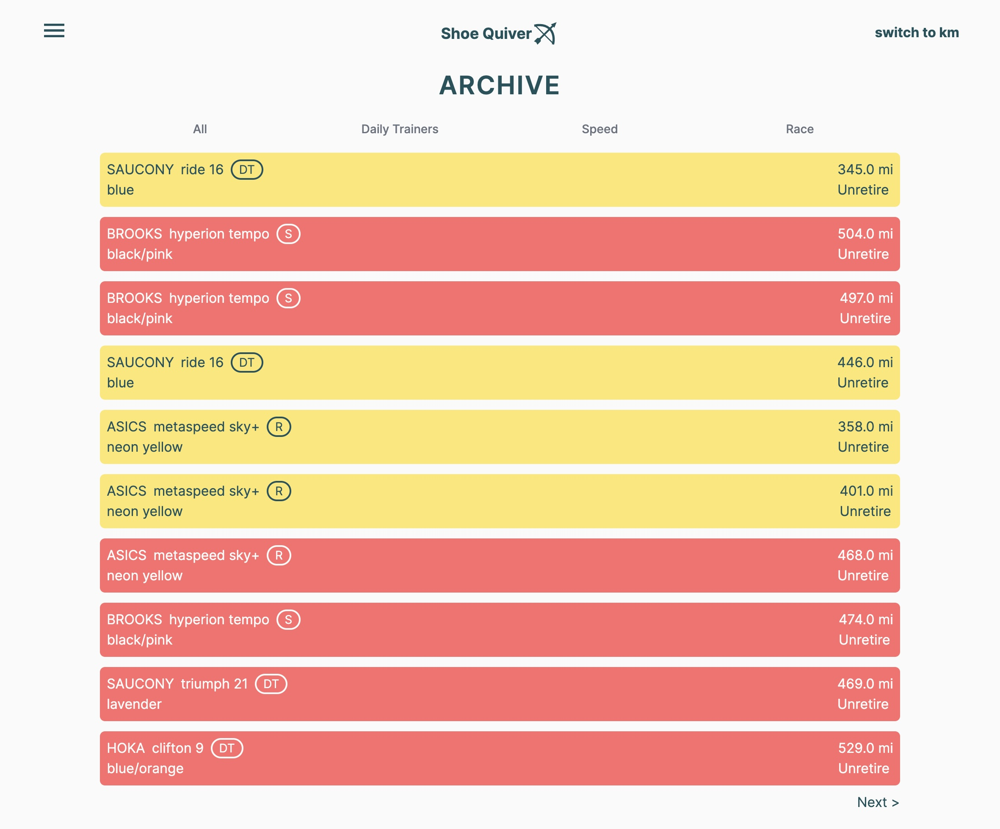
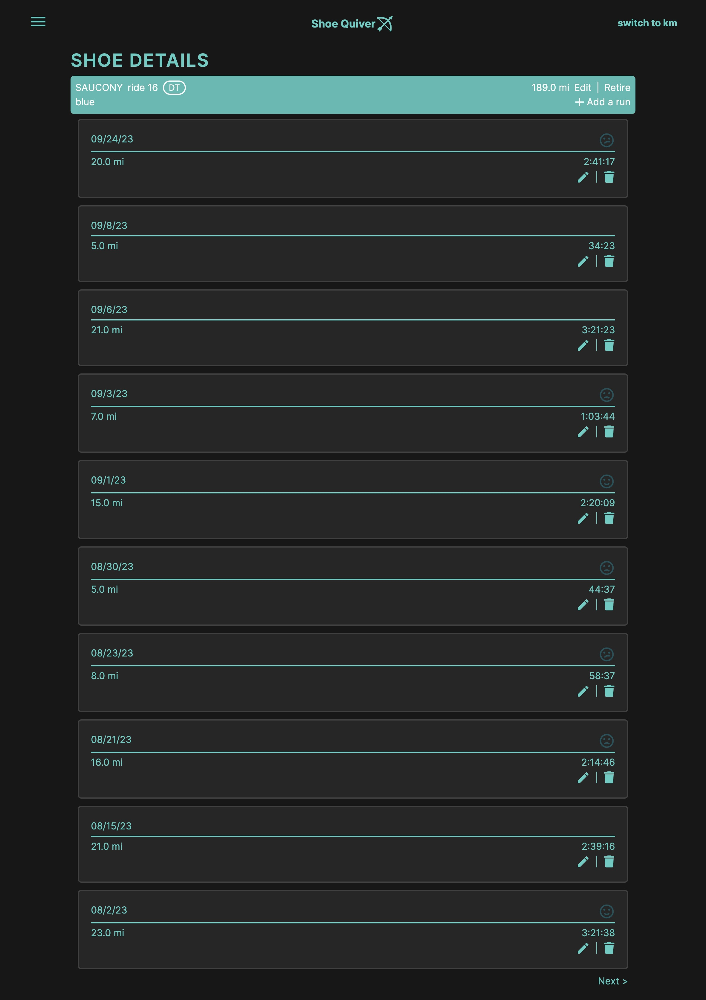

# Shoe Quiver

A full-stack Rails app for runners to keep track of their shoe mileage. 

## Features

- Stimulus controller to keep current shoes in reverse chronolocial order of their last run so as to encourage rotation
- Shoes are color coded by percentage of mileage to retirement
- An archive of past shoes so users never forget a model
- A calendar display of runs, color coded by how the run felt so users can keep an eye on early indicators of overtraining.
- Tabs to view shoes by category (i.e. daily trainer, speed, race)

## To run locally

Clone and run: 

```
bundle install
```

### Screenshots

Current rotation:



With new shoe form:



Runs page:





Archive:



Shoe show page: 



### Built with

- Ruby on Rails
- Tailwind
- Postgresql